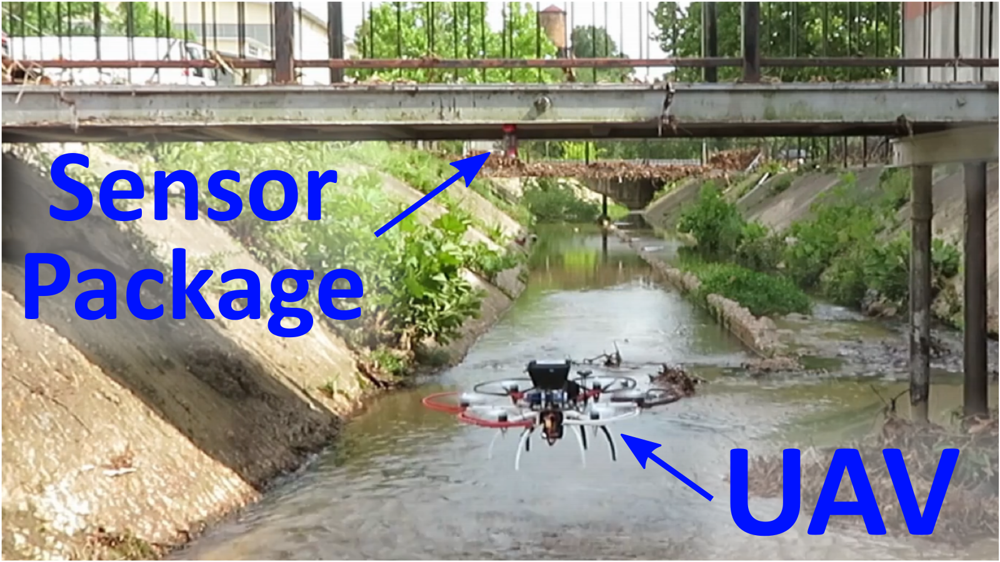

# Drone Delivered Vibration Sensor
UAV deployable sensor package for vibration-based structural health monitoring.

  

Figure 1: Video of UAV deploying a sensor package in the Rock Branch Creek at the University of South Carolina. UAV under manual control. Click the image to view the video on YouTube. 

## [Media](Media)
Includes figures and diagrams of the drone deliverable vibration sensor.

## [System Design](System_design)
Vibration sensor package: includes sensor package software (Arduino) and hardware (circuit) files along with package frame design.

   

## Licensing and Citation

[![CC BY-SA 4.0][cc-by-sa-shield]][cc-by-sa]

This work is licensed under a
[Creative Commons Attribution-ShareAlike 4.0 International License][cc-by-sa].

[cc-by-sa]: http://creativecommons.org/licenses/by-sa/4.0/
[cc-by-sa-image]: https://licensebuttons.net/l/by-sa/4.0/88x31.png
[cc-by-sa-shield]: https://img.shields.io/badge/License-CC%20BY--SA%204.0-lightgrey.svg

Cite as:

@Misc{SatmeDroneDeliveredVibration,     
  author = {Joud Satme and Ryan Yount and Austin Downey},  
    howpublished = {GitHub},    
  title  = {Drone Delivered Vibration Sensor},
  groups = {{ARTS-L}ab},    
  url    = {https://github.com/ARTS-Laboratory/Drone-Delivered-Vibration-Sensor},   
}

